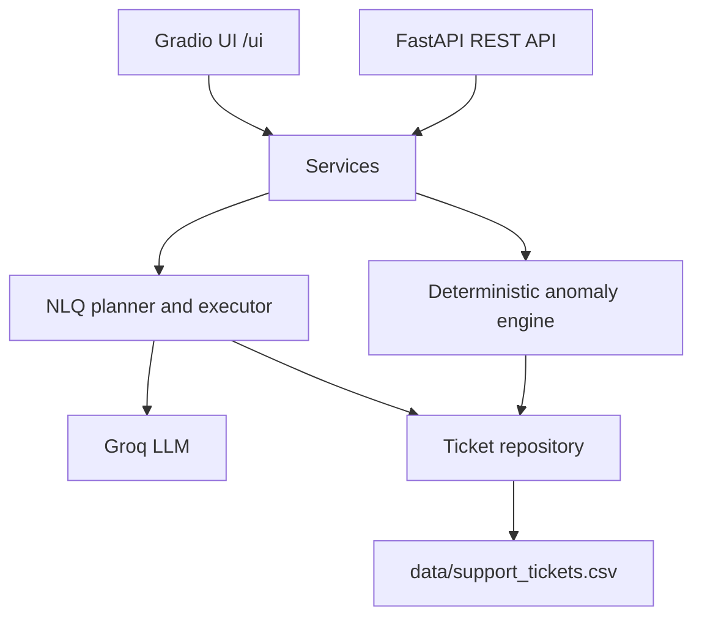
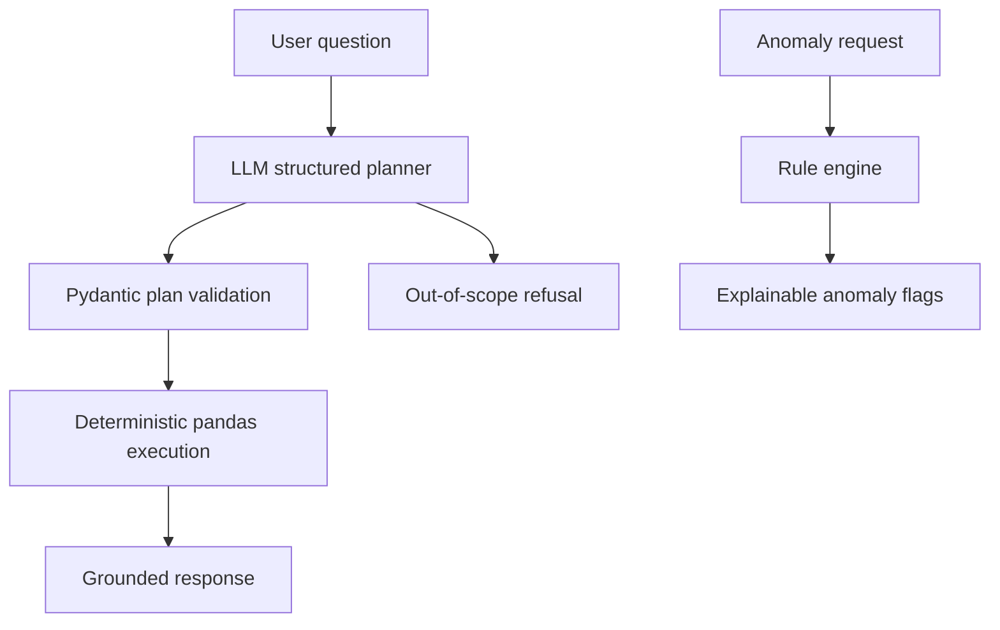

# Support Ticket Intelligence

Support Ticket Intelligence is a Python/FastAPI project for analyzing the provided `support_tickets.csv` dataset. It ingests the CSV, answers natural-language questions with an LLM-backed planner, detects explainable anomalies, and exposes the same functionality through a REST API and a minimal Gradio UI.

## What It Does

- Loads and validates the 500-row support ticket CSV.
- Answers natural-language questions such as open-ticket counts, monthly agent rankings, critical late tickets, and average ratings.
- Uses an LLM for natural-language understanding and deterministic Python code for execution.
- Detects anomalies without an LLM, so anomaly detection works even without an API key.
- Runs as one FastAPI process with API docs at `/docs` and UI at `/ui`.

## Tech Stack

| Tool | Purpose | Why chosen |
|---|---|---|
| FastAPI | REST API | Simple, typed, production-friendly Python API framework |
| Gradio | Minimal UI | Quick local UI mounted into the same FastAPI process |
| Groq | LLM planner | Free-tier LLM option for natural-language understanding |
| pandas | Data ingestion and analytics | Excellent fit for a 500-row CSV assessment dataset |
| Pydantic | Request/config validation | Strong typed models and settings |
| pytest | Regression tests | Verifies dataset facts and anomaly counts |

## Architecture





The code follows a layered shape from the assessment prompt:

- `app/api`: FastAPI routes and schemas.
- `app/ui`: Gradio interface.
- `app/services`: business use cases shared by API and UI.
- `app/nlq`: LLM planning and deterministic query execution.
- `app/anomaly`: explainable anomaly rules.
- `app/data`: CSV loading, cleaning, derived columns, and quality report.
- `app/core`: configuration, exceptions, and time handling.

## Quickstart

1. Create and activate a virtual environment.

Windows:

```powershell
python -m venv .venv
.\.venv\Scripts\Activate.ps1
```

macOS/Linux:

```bash
python -m venv .venv
source .venv/bin/activate
```

2. Install dependencies.

```bash
pip install -r requirements.txt
```

3. Configure environment variables.

```bash
copy .env.example .env
```

On macOS/Linux:

```bash
cp .env.example .env
```

Add your free Groq API key to `.env`:

```text
GROQ_API_KEY=your_real_key_here
```

4. Start the app with one command.

```bash
uvicorn app.main:app --port 8000
```

5. Open:

- UI: `http://localhost:8000/ui`
- API docs: `http://localhost:8000/docs`
- Health: `http://localhost:8000/health`

The app still starts without `GROQ_API_KEY`. In that mode, `/health`, `/schema`, `/anomalies`, and the UI anomaly tab work; `/query` reports that the LLM is not configured.

## API Reference

### GET `/health`

Returns row count, as-of timestamp, data quality summary, and LLM configuration status.

```bash
curl http://localhost:8000/health
```

### POST `/query`

Uses the LLM to map a natural-language question to a structured plan, then executes that plan deterministically.

```bash
curl -X POST http://localhost:8000/query ^
  -H "Content-Type: application/json" ^
  -d "{\"question\":\"How many tickets are currently open?\"}"
```

Example answer from the dataset:

```json
{
  "answer": "There are 111 currently open tickets.",
  "intent": "open_count",
  "row_count": 1,
  "as_of": "2024-03-30 18:06:00"
}
```

### GET `/anomalies`

Runs deterministic anomaly detection.

```bash
curl "http://localhost:8000/anomalies?rule=stale_unresolved&limit=5"
```

Supported rules:

- `resolution_outlier`
- `stale_unresolved`
- `response_sla`
- `data_integrity`

### GET `/schema`

Returns the data dictionary and glossary used by the planner.

```bash
curl http://localhost:8000/schema
```

## Example Ground Truths

These values come from the provided CSV:

| Question | Expected result |
|---|---:|
| How many tickets are currently open? | 111 |
| Which agent resolved the most tickets this month? | AGT-01 with 16 tickets |
| Show me all Critical tickets not resolved within 12 hours. | 34 tickets |
| What is the average customer rating for Technical category tickets? | Computed from rated Technical tickets only |
| Are there any anomalies in resolution times this week? | Computed by per-priority IQR for the as-of week |

The default as-of timestamp is the maximum `created_at` in the data: `2024-03-30 18:06:00`.

## Anomaly Rules

| Rule | Meaning |
|---|---|
| `resolution_outlier` | Resolved ticket exceeds its priority group's `Q3 + 1.5 * IQR` resolution-time fence |
| `stale_unresolved` | High or Critical ticket is Open/Escalated and older than 24 hours |
| `response_sla` | Response time is greater than an assumed 4-hour SLA |
| `data_integrity` | `resolution_time_hrs` is lower than `response_time_hrs` |

Important verified counts:

- Data integrity anomalies: 28
- High/Critical unresolved older than 24h: 80
- Per-priority resolution outliers: 18

## Tests

Install dev dependencies and run:

```bash
pip install -r requirements-dev.txt
pytest
```

The tests verify dataset facts, key query ground truths, and anomaly counts.

## Design Decisions

- The API and UI both call services directly. This keeps business logic in one place.
- The LLM only plans the query intent. It does not directly compute numbers.
- Anomaly detection is deterministic and explainable, so it works without an LLM key.
- Docker is not included because the assessment only requires one-command startup. `uvicorn app.main:app --port 8000` satisfies that requirement.

## Known Limitations

- The NL query planner currently supports the assessment's main query families plus out-of-scope refusal. It is designed to be extended by adding new intents and deterministic executors.
- There is no `resolved_at` column, so “resolved this month” uses `created_at` month and discloses that assumption.
- Response SLA is an assumption because the dataset does not define an official SLA.
- The app uses pandas rather than a database because the dataset is small and fixed at 500 rows.

## Troubleshooting

- `GROQ_API_KEY is not configured`: add a free Groq key to `.env`.
- `ModuleNotFoundError`: run `pip install -r requirements.txt`.
- Port already in use: run `uvicorn app.main:app --port 8001`.
- Groq model not found: change `GROQ_MODEL` in `.env` to a model available in your Groq account.
